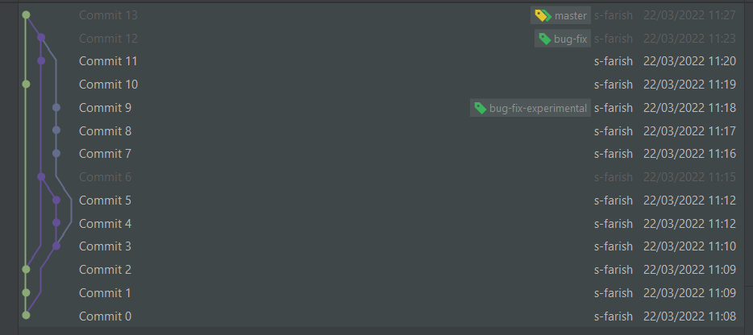

Commit 0
<<<<<<< HEAD

git branch bug-fix
Commit 1- further commit on master branch
Commit 2 - further commit on master branch
git checkout bug-fix
Commit 3 - commit on bug-fix branch
git branch bug-fix-experimental
Commit 4 - further commit on bug-fix branch
Commit 5 - further commit on bug-fix branch
git merge master
manually editted MD file
Commit 6 - further commit on bug-fix branch with edited changes.
git checkout bug-fix-experimental
Commit 7 - commit on bug-fix-experimental
Commit 8 - further commit on bug-fix-experimental
Commit 9 - further commit on bug-fix-experimental
git checkout master
Commit 10 - commit on master branch
manually edit FD file to resolve conflic
git checkout bug-fix
Commit 11 - commit on bug-fix branch
git merge bug-fix-experimental
Commit 12 -will merge conflicts on bug-fix branch
manually edited MD file
git checkout master
manually edit FD file to resolve conflicts
Commit 13 - commit on master branch
